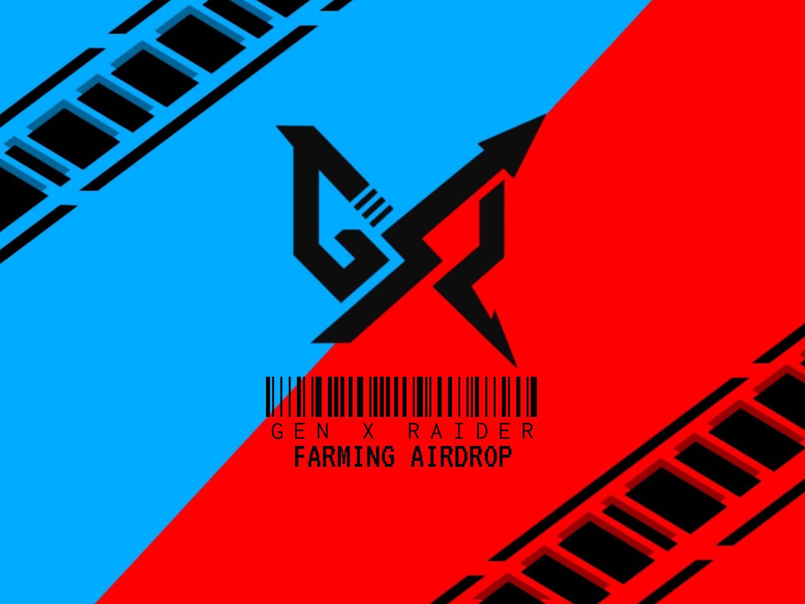

# 🤖 GXR Grambot - Telegram Airdrop Bot



A Telegram airdrop bot with a 7-level evolution system integrated with a modern web dashboard and blockchain system.

## 📋 System Description

GXR Grambot is a Telegram airdrop bot that uses a hybrid architecture with:

- **Python Backend**: Main Telegram bot for user interaction
- **Node.js/Express**: API server for the web dashboard
- **React Frontend**: Modern dashboard with real-time updates
- **PostgreSQL**: Persistent database using Drizzle ORM

## 🎮 Key Features

### ⚡ 7-Level Evolution System

- **Evol 1 (Rookie)**: 0–999 points, 500H pool
- **Evol 2 (Charger)**: 1,000–14,999 points, 1M pool
- **Evol 3 (Breaker)**: 15,000–29,999 points, 1.2M pool
- **Evol 4 (Phantom)**: 30,000–49,999 points, 1.8M pool
- **Evol 5 (Overdrive)**: 50,000–99,999 points, 2.5M pool
- **Evol 6 (Genesis)**: 100,000–249,999 points, 3M pool
- **Evol 7 (Final Form)**: 250,000+ points, 7M pool
- **Total Airdrop**: 17,000,000 [20% of total supply]

### 🚜 Farming System

- Claim rewards every 6 hours (250 points per claim)
- Auto-reset timer for next farming round
- Real-time countdown on the dashboard

### ✅ Task Management

- **Original Tasks**: Core bot tasks
- **Partnership Tasks**: Partner collaboration tasks
- **Collaborator Tasks**: Exclusive collaborator tasks
- Completion tracking with progress bar

### 👥 Referral System

- Unique referral code per user
- 50-point reward for referrers
- Total referrals and earnings tracking

### 💳 Wallet Integration

- Supports 12+ wallets (MetaMask, Trust Wallet, etc.)
- Wallet connection for claiming rewards
- Address validation and secure storage

### 🏆 Ranking & Leaderboard

- Real-time ranking based on points
- Global leaderboard with pagination
- Track user’s own rank position

## 📁 Folder Structure

```
extracted/GuideMate/
├── Python Bot Files
│   ├── main.py              # Entry point with PID management
│   ├── commands.py          # Telegram command handler
│   ├── users.py             # User management & claiming
│   ├── evol.py              # 7-tier evolution system
│   ├── tasks.py             # Task management
│   ├── pool.py              # Reward pool distribution
│   ├── ranking.py           # Leaderboard functionality
│   ├── referral.py          # Referral system
│   ├── config.py            # Bot configuration
│   └── requirements.txt     # Python dependencies
│
├── React Dashboard
│   ├── client/src/
│   │   ├── pages/           # Pages (Farming, Tasks, Rank, etc.)
│   │   ├── components/      # UI components
│   │   └── hooks/           # Custom hooks & WebSocket
│   └── index.html           # Dashboard entry point
│
├── Node.js Backend  
│   ├── server/
│   │   ├── index.ts         # Express server
│   │   ├── routes.ts        # API endpoints
│   │   └── storage.ts       # Database layer
│   └── shared/schema.ts     # Database schema
│
└── Configuration
    ├── package.json         # Node dependencies
    ├── drizzle.config.ts    # Database configuration
    └── .replit              # Replit configuration
```

## 🚀 Quick Start

### 1. Set Up Environment

```bash
# Set environment variables in Replit Secrets
BOT_TOKEN=your_telegram_bot_token
DATABASE_URL=your_postgresql_url
```

### 2. Install Dependencies

```bash
# Python dependencies (auto-installed)
pip install -r requirements.txt

# Node.js dependencies (auto-installed)
npm install
```

### 3. Run the Bot

```bash
# Start Python bot
python main.py

# Start dashboard (in a separate terminal)
npm run dev
```

### 4. Set Bot Commands

In Telegram BotFather, set the commands:

```
start - 🚀 Start the bot and open main menu
claim - 🚜 Claim farming reward  
rank - 🏆 View your rank and status
connectwallet - 💳 Connect wallet to claim
referral - 👥 View your referral code
usecode - ✅ Use referral code
```

## 🛠️ Tech Stack

### Python Backend

- `python-telegram-bot==20.7` - Telegram bot framework
- `urllib3` - HTTP client library
- Process management using PID file

### Node.js Backend

- `express` - Web server framework
- `drizzle-orm` - Database ORM
- `@neondatabase/serverless` - PostgreSQL driver
- WebSocket for real-time updates

### React Frontend

- `React 18` - UI framework
- `Radix UI` - Component library
- `Tailwind CSS` - Styling framework
- `wouter` - Routing
- `react-query` - State management

### Database

- **PostgreSQL** - Primary database
- **Neon Database** - Serverless PostgreSQL
- **Drizzle ORM** - Type-safe database access

## 📱 Dashboard Features

### 🎮 Bottom Navigation (5 Sections)

1. **🚜 Farming**: Claim rewards, timer countdown
2. **✅ Task Completed**: Track completed tasks
3. **🏆 Rank**: Evolution status, leaderboard
4. **👤 Profile**: User stats, referral info
5. **💳 Wallet Connect**: Multi-wallet support

### 🎨 Design System

- Dark gaming theme with GXR green/blue
- Mobile-first responsive design
- Loading screen with startup background
- Real-time notifications and updates

## 🔧 Configuration

### Bot Configuration (`config.py`)

```python
CLAIM_INTERVAL_HOURS = 6    # Farming claim interval
CLAIM_REWARD = 250          # Points per claim
REFERRAL_REWARD = 50        # Points per referral
```

### Pool Configuration

Reward pools per evolution level are pre-configured according to the 7-tier system.

## 📊 Monitoring & Management

### Process Management

- PID file to prevent multiple instances
- Graceful shutdown via signal handling
- Auto-restart capability

### Admin Features

- Export user data as CSV
- System monitoring via dashboard
- Real-time user analytics

## 📞 Support & Development

### Development Mode

```bash
# Bot development
python main.py

# Dashboard development
npm run dev
```

### Production Deployment

Ready to deploy on Replit with:

- Auto-installing dependencies
- Environment variable management
- Always-on capability with health check

### Troubleshooting

- Check bot PID: `cat bot.pid`
- Stop bot: `python stop_bot.py`
- Restart bot: `python main.py`
- Dashboard logs: Use browser console

---

**🎮 GXR Grambot - Evolution Gaming Experience**

